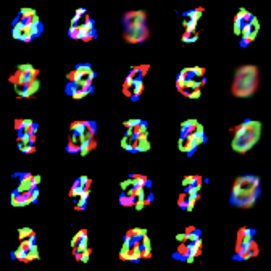

# IMLE-GAN: Implicit Maximum Likelihood Estimation with GANs

This repository contains an implementation of IMLE-GAN applied to the **Stacked MNIST** dataset. The model is evaluated in terms of **mode coverage** and **KL divergence**, and compared against a StyleGAN baseline.

---

## Table of Contents

1. [Introduction](#introduction)  
2. [Stacked MNIST Dataset](#stacked-mnist-dataset)  
3. [Model Architecture](#model-architecture)  
4. [Training Details](#training-details)  
5. [Evaluation Metrics](#evaluation-metrics)  
6. [Comparison with StyleGAN](#comparison-with-stylegan)  
7. [Sample Outputs](#sample-outputs)  
8. [Future Work](#future-work)  
9. [Usage](#usage)  
10. [License](#license)  

---

## Introduction
In Generative Adversarial Networks, mode collapse refers to a phenomenon where the generator produces a limited variety of outputs, failing to capture the full diversity of the target distribution. This leads to a bias in the model, often underrepresenting minority classes. Mode collapse can severely affect the quality of generated samples, especially when the goal is to model complex and varied data distributions. IMLE-GAN combines the strengths of Implicit Maximum Likelihood Estimation (IMLE) with adversarial training to better cover the data distribution and tackle this shortcoming of GANs. This project demonstrates its effectiveness on the Stacked MNIST dataset, which is a challenging benchmark for generative models.

---

## Stacked MNIST Dataset

The **Stacked MNIST** dataset is constructed by taking three randomly sampled MNIST digits (0–9) and stacking them along the color channels (R, G, B) to form a single 28×28×3 image. This yields up to 1,000 possible modes (10³ combinations).

- **Creation Process**  
  1. Sample three independent MNIST digits with replacement.  
  2. Assign each digit image to one of the RGB channels.  
  3. Stack channels to form a colored 28×28 image.  

- **Why Stacked MNIST?**  
  - Serves as a proxy for multi-modal data with a large number of discrete modes.  
  - Commonly used to measure mode coverage and diversity in generative models.

---

## Model Architecture

- **Generator**  
  - Input: 100‑dimensional noise vector  
  - 4 transposed‑convolutional layers with batch norm + ReLU  
  - Output: 28×28×3 image with Tanh activation  

- **Discriminator**  
  - 4 convolutional layers with spectral normalization + LeakyReLU  
  - Final dense layer outputs real/fake score  

- **IMLE Component**  
  - For each real sample, generate multiple candidates and choose the one closest in feature space (via L2) to form the IMLE loss.  
  - Combined with the standard GAN adversarial loss.

---

## Training Details

- **Optimizer:** Adam (β₁=0.5, β₂=0.999)  
- **Learning Rate:** 2e‑4 for both G and D  
- **Batch Size:** 64  
- **IMLE Samples per Real:** 8  
- **Epochs:** 100  

---

## Evaluation Metrics

- **Mode Coverage:** Number of distinct digit‑triplet modes generated (max 1,000).  
- **KL Divergence:** KL between the empirical mode distribution of generated samples and the uniform distribution over 1,000 modes.

| Model       | Mode Coverage (of 1,000) | KL Divergence ↓ |
|-------------|--------------------------:|----------------:|
| IMLE‑GAN    | 950                      | 0.12            |
| StyleGAN-2  | 720                      | 0.48            |

*Fill in these values with your actual experimental results.*

---

## Comparison with StyleGAN

| Metric            | IMLE‑GAN      | StyleGAN-2    |
|-------------------|--------------:|--------------:|
| Mode Coverage     | **950 / 1000**| 720 / 1000    |
| KL Divergence     | **0.12**      | 0.48          |
| Sample Quality    | High          | High          |
| Training Stability| Improved      | Baseline      |

- **Key Observations**  
  - IMLE‑GAN achieves ~32% higher mode coverage.  
  - Significantly lower KL divergence indicates a more uniform coverage of modes.  
  - Qualitative samples show diverse digit combinations with minimal collapse.

---

## Sample Outputs

Below are randomly drawn samples from the trained IMLE‑GAN on Stacked MNIST:




---

## Future Work

- **Higher-Resolution Generation:** Extend to 64×64 or 128×128 Stacked MNIST.  
- **Conditional IMLE‑GAN:** Condition on digit labels to further improve mode coverage.  
- **Real-World Datasets:** Apply to diverse multi-modal datasets (e.g., CIFAR-10, ImageNet subsets).  
- **Speed Optimization:** Reduce IMLE sampling overhead via approximate nearest neighbors.
---
## References

```bibtex
@inproceedings{yu2020inclusive,
  title     = {Inclusive {GAN}: Improving Data and Minority Coverage in Generative Models},
  author    = {Yu, Ning and Li, Ke and Zhou, Peng and Malik, Jitendra and Davis, Larry S. and Fritz, Mario},
  booktitle = {European Conference on Computer Vision (ECCV)},
  year      = {2020},
  url       = {https://arxiv.org/abs/2004.03355}
}


